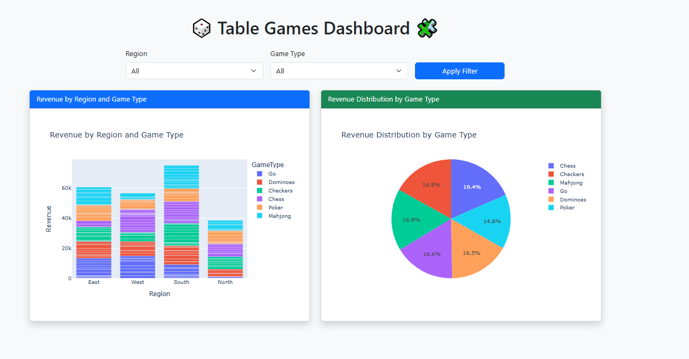

# 🎲 Table Games Dashboard

A SaaS-style dashboard built with **Flask**, **Plotly**, and **Bootstrap**. This interactive app visualizes simulated data from popular table games like Chess, Checkers, Poker, and Mahjong.

## 🚀 Features

- 📊 Interactive bar and pie charts using Plotly
- 🎛 Dynamic dropdown filters for Region and Game Type
- 🧠 Clean Bootstrap layout for responsive UI
- 🛠 Synthetic data generated via Python

---

## 📂 Folder Structure

```text
table-games-dashboard/
├── app.py                 # Flask web app
├── data_utils.py          # Data loading & transformation
├── generate_table_data.py # Generates fake table game data
├── table_games_data.csv   # Output data for the dashboard
├── templates/
│   └── index.html         # HTML page (Jinja2 template)
├── static/                # (Optional: add CSS or JS here)
├── images/
│   └── dashboard-preview.png # Screenshot for README
└── requirements.txt       # Python dependencies


## 🧪 Demo




